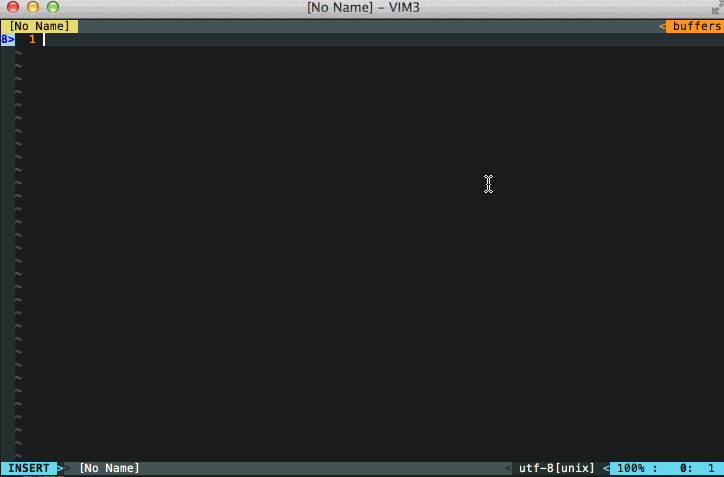

# vim-fetch-jira

`fetch-jira` is a Vim plugin that queries JIRA issues and finds relevant information on each

## Demo



## How to use
\<F6\> in insert mode.

## Installation
```
Plugin 'DanBradbury/vim-fetch-jira'
```

## Dependency
python support and [requests](http://docs.python-requests.org/) package.

```
pip install requests
```

## Settings

in your .vimrc,

```
let g:jiracomplete_url = 'http://your.jira.url/'
let g:jiracomplete_username = 'your_jira_username'
let g:jiracomplete_password = 'your_jira_password'  " optional
```

Special thanks to @mnpk for writing the jira-complete plugin that inspired this.
