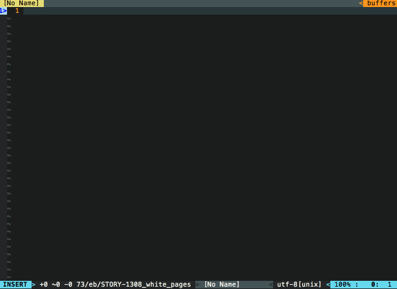
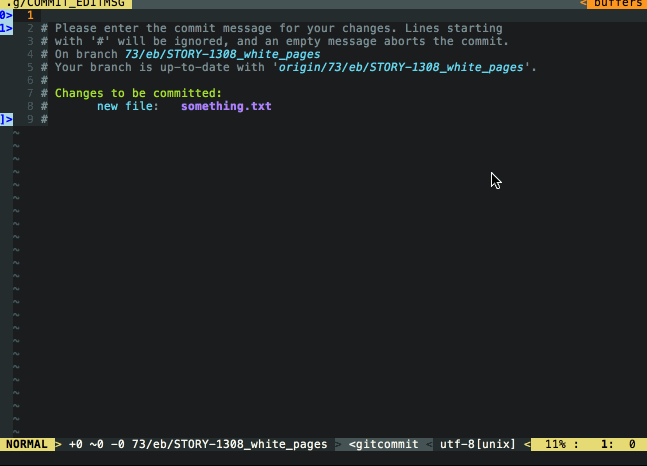

# vim-fetch-jira

`fetch-jira` is a Vim plugin that queries JIRA issues and finds relevant information on each

## How to use
Get infomation on Unresolved Issues that you are assigned to

  - \<F6\> in insert mode.

Insert Jira ticket summary for git commit message

  - \<F7> in insert mode

Get an overview of work remaining for the current sprint. Helpful for scrum masters who want to high level view of the teams progress.

  - \<F8\> in insert mode

## Installation (Vundle)
```
Plugin 'DanBradbury/vim-fetch-jira'
:PluginInstall
```

## Dependency
python support and [requests](http://docs.python-requests.org/) package.

```
pip install requests
```

## Settings

in your .vimrc,

```
let g:jiracomplete_url = 'http://your.jira.url/'
let g:jiracomplete_username = 'your_jira_username'
let g:jiracomplete_auth = 'your_jira_password'  " optional. You will be prompt if not supplied
let g:jira_team_name = 'your_team_name' "label used for the team
let g:jira_current_sprint = 'sprint_num' "integer value of sprint#
```

Special thanks to @mnpk for writing the [jira-complete](https://github.com/mnpk/vim-jira-complete) plugin that inspired this.
